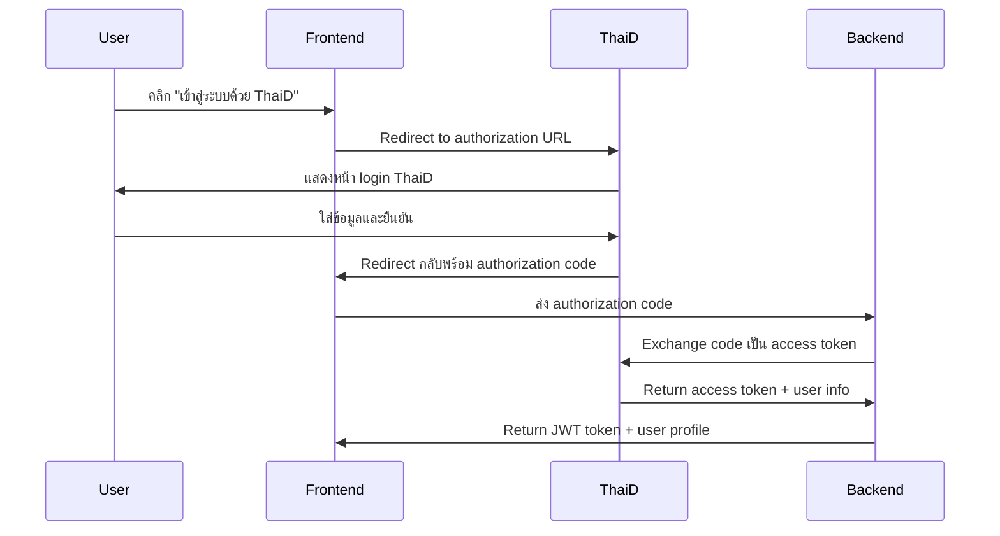

# ระบบจัดการสมาชิกและการ Authentication

## ภาพรวมระบบ

ระบบ authentication ที่พัฒนาขึ้นสำหรับ Thai Hajj Health System รองรับการจัดการผู้ใช้ 4 วิธี:

### วิธีการ Login ที่รองรับ:
1. **ผู้ดูแลระบบ (Admin)**: Username/Password
2. **เจ้าหน้าที่ (Staff)**: Username/Password + HCODE
3. **ผู้บริหาร (Executive)**: Username/Password  
4. **🆕 ThaiD Digital ID**: OAuth 2.0 + OpenID Connect (สำหรับทุก Role)

## คุณสมบัติหลัก

### 🔐 Authentication & Authorization
- ✅ Login แยกตามประเภทผู้ใช้ (Username/Password)
- ✅ 🆕 **ThaiD Digital ID Integration** (OAuth 2.0 + OpenID Connect)
- ✅ JWT Token management with auto-refresh
- ✅ Role-based access control (RBAC)
- ✅ Permission-based authorization
- ✅ Auto redirect เมื่อ token หมดอายุ
- ✅ 🆕 **Citizen ID Verification** ผ่าน ThaiD

### 🏥 HCODE System สำหรับเจ้าหน้าที่
- ✅ รองรับรหัส HCODE (รพ. 5 หลัก, รพ.สต. 5 หลัก)
- ✅ Validation รูปแบบ HCODE
- ✅ ตรวจสอบข้อมูลหน่วยบริการ

### 🛡️ Security Features  
- ✅ Route protection middleware
- ✅ Client-side & Server-side validation
- ✅ Secure token storage
- ✅ Automatic session management

## โครงสร้างไฟล์

```
src/
├── types/
│   └── auth.ts                 # Type definitions
├── services/
│   └── auth.service.ts         # API service layer
├── context/
│   └── AuthContext.tsx         # Authentication context
├── components/
│   └── auth/
│       ├── AuthGuard.tsx       # Route protection
│       ├── AdminLoginForm.tsx  # Admin login
│       ├── StaffLoginForm.tsx  # Staff login (with HCODE)
│       └── ExecutiveLoginForm.tsx # Executive login
├── app/
│   ├── (auth)/
│   │   └── signin/
│   │       ├── page.tsx        # Login selection
│   │       ├── admin/page.tsx  # Admin login
│   │       ├── staff/page.tsx  # Staff login  
│   │       └── executive/page.tsx # Executive login
│   ├── (admin)/               # Admin dashboard
│   ├── (staff)/               # Staff dashboard
│   └── (executive)/           # Executive dashboard
└── middleware.ts              # Route middleware
```

## การใช้งาน

### 1. ตั้งค่าระบบ

```bash
# 1. Copy environment variables
cp .env.example .env.local

# 2. แก้ไข API URL
NEXT_PUBLIC_API_URL=https://your-api-domain.com
```

### 2. การ Login

ผู้ใช้สามารถเลือกประเภทการ login ได้ที่ `/signin`:

- **Admin**: `/signin/admin`
- **Staff**: `/signin/staff` (ต้องระบุ HCODE)
- **Executive**: `/signin/executive`

### 3. การใช้งาน Authentication Context

```tsx
import { useAuth } from '@/context/AuthContext';

function MyComponent() {
  const { user, isAuthenticated, login, logout } = useAuth();
  
  // ตรวจสอบ role
  if (user?.role === 'admin') {
    // แสดงเนื้อหาสำหรับ admin
  }
}
```

### 4. การป้องกัน Route

```tsx
import { AdminGuard } from '@/components/auth/AuthGuard';

function AdminPage() {
  return (
    <AdminGuard>
      <div>เนื้อหาสำหรับ admin เท่านั้น</div>
    </AdminGuard>
  );
}
```

### 5. การตรวจสอบ Permission

```tsx
import { usePermission } from '@/context/AuthContext';
import { PERMISSIONS } from '@/types/auth';

function MyComponent() {
  const canManageUsers = usePermission(PERMISSIONS.USER_MANAGEMENT);
  
  return (
    <div>
      {canManageUsers && (
        <button>จัดการผู้ใช้</button>
      )}
    </div>
  );
}
```

## 🆕 ThaiD Integration - สิ่งที่ต้องเตรียม

### 1. การลงทะเบียนกับ ThaiD
```bash
# ขั้นตอนลงทะเบียน
1. สมัครเป็น Service Provider กับ ThaiD
2. ขอ Client ID และ Client Secret
3. กำหนด Redirect URLs
4. ตั้งค่า Scope permissions
```

### 2. Environment Variables ที่ต้องเพิ่ม
```bash
# ThaiD OAuth Configuration
THAID_CLIENT_ID=your-thaid-client-id
THAID_CLIENT_SECRET=your-thaid-client-secret
THAID_REDIRECT_URI=https://domain.com/auth/thaid/callback
THAID_SCOPE=openid profile citizen_id
THAID_AUTH_URL=https://imauth.bora.dopa.go.th/oauth2/authorize
THAID_TOKEN_URL=https://imauth.bora.dopa.go.th/oauth2/token
THAID_USERINFO_URL=https://imauth.bora.dopa.go.th/oauth2/userinfo
```

### 3. Frontend Components ที่ต้องสร้าง
```typescript
// components/auth/ThaiDLoginButton.tsx
// components/auth/ThaiDCallback.tsx
// components/auth/ThaiDUserProfile.tsx
```

### 4. API Endpoints เพิ่มเติม

### Authentication Endpoints
```
POST /auth/admin/login      # Admin login
POST /auth/staff/login      # Staff login (with HCODE)
POST /auth/executive/login  # Executive login

# 🆕 ThaiD OAuth Endpoints
GET  /auth/thaid/login      # เริ่มต้น OAuth flow
POST /auth/thaid/callback   # Handle OAuth callback
GET  /auth/thaid/profile    # Get ThaiD user profile
POST /auth/thaid/link       # Link ThaiD to existing account

POST /auth/logout           # Logout
POST /auth/refresh          # Refresh token
GET  /auth/verify           # Verify token
```

### Data Endpoints
```
GET /auth/hospital-codes    # ดึงรายชื่อ HCODE
GET /users/by-citizen-id/:id # ค้นหาผู้ใช้ด้วยเลขประชาชน
```

## ตัวอย่าง API Response

### Login Response
```json
{
  "success": true,
  "data": {
    "user": {
      "id": "user123",
      "username": "staff001",
      "email": "staff@hospital.go.th",
      "role": "staff",
      "fullName": "นายสมชาย ใจดี",
      "hcode": "12345678",
      "hospitalInfo": {
        "hcode": "12345678",
        "hospitalName": "รพ.สต.บ้านนา",
        "type": "health_station",
        "province": "เชียงใหม่"
      },
      "permissions": ["staff.view_data", "staff.edit_data"],
      "isActive": true
    },
    "token": {
      "accessToken": "jwt-token-here",
      "refreshToken": "refresh-token-here", 
      "expiresIn": 86400,
      "tokenType": "Bearer"
    }
  },
  "message": "เข้าสู่ระบบสำเร็จ"
}
```

## การกำหนดสิทธิ์

### Admin
- จัดการผู้ใช้และระบบทั้งหมด
- เข้าถึงได้ทุกฟังก์ชัน

### Staff  
- บันทึกข้อมูลผู้ป่วย
- จัดการข้อมูลหน่วยบริการของตนเอง
- ส่งรายงาน

### Executive
- ดูรายงานและสถิติ
- ดาวน์โหลดข้อมูล
- เข้าถึง Dashboard ผู้บริหาร

## การ Deploy

1. **ตั้งค่า Environment Variables**
2. **เตรียม API Backend** ที่รองรับ endpoints ข้างต้น
3. **ทดสอบการเชื่อมต่อ API**
4. **Deploy โปรเจ็ค**

## Security Notes

- 🔒 Token จัดเก็บใน localStorage (สำหรับ development)
- 🔒 ใช้ HTTPS สำหรับ production
- 🔒 Token auto-refresh ก่อนหมดอายุ
- 🔒 Route protection ทั้ง client และ server side

## 🛠️ ThaiD Integration - Technical Implementation

### 1. OAuth 2.0 Flow


### 2. ThaiD User Data Structure
```json
{
  "sub": "citizen_id_13_digits",
  "name": "นายสมชาย ใจดี",
  "given_name": "สมชาย",
  "family_name": "ใจดี",
  "middle_name": "",
  "nickname": "",
  "preferred_username": "somchai.jaidee",
  "profile": "",
  "picture": "https://thaid.pic.url",
  "website": "",
  "email": "somchai@email.com",
  "email_verified": true,
  "gender": "male",
  "birthdate": "1990-01-15",
  "zoneinfo": "Asia/Bangkok",
  "locale": "th_TH",
  "phone_number": "+66812345678",
  "phone_number_verified": true,
  "address": {
    "formatted": "123 ถนนสุขุมวิท แขวงคลองเตย เขตคลองเตย กรุงเทพมหานคร 10110",
    "street_address": "123 ถนนสุขุมวิท",
    "locality": "แขวงคลองเตย",
    "region": "เขตคลองเตย",
    "postal_code": "10110",
    "country": "TH"
  },
  "updated_at": 1699123200
}
```

### 3. Database Schema เพิ่มเติม
```sql
-- เพิ่มคอลัมน์ในตาราง users
ALTER TABLE users ADD COLUMN thaid_sub VARCHAR(13); -- Citizen ID
ALTER TABLE users ADD COLUMN thaid_verified BOOLEAN DEFAULT FALSE;
ALTER TABLE users ADD COLUMN login_method ENUM('password', 'thaid', 'both') DEFAULT 'password';

-- ตาราง ThaiD tokens
CREATE TABLE thaid_tokens (
  id INT AUTO_INCREMENT PRIMARY KEY,
  user_id INT NOT NULL,
  access_token TEXT NOT NULL,
  refresh_token TEXT,
  expires_at TIMESTAMP NOT NULL,
  created_at TIMESTAMP DEFAULT CURRENT_TIMESTAMP,
  FOREIGN KEY (user_id) REFERENCES users(id)
);
```

### 4. Security Considerations
```typescript
// การตรวจสอบและเชื่อม ThaiD account
interface ThaiDLinkingProcess {
  // 1. ตรวจสอบว่ามี account อยู่แล้วหรือไม่
  existingUser: User | null;
  
  // 2. ถ้ามี account แล้ว -> Link ThaiD
  // 3. ถ้าไม่มี -> สร้าง account ใหม่
  autoCreateAccount: boolean;
  
  // 4. ตรวจสอบ Citizen ID ซ้ำ
  citizenIdValidation: boolean;
  
  // 5. Role assignment logic
  roleAssignment: 'auto' | 'manual';
}
```

### 5. Frontend Implementation
```typescript
// ThaiD Login Button
export const ThaiDLoginButton = () => {
  const handleThaiDLogin = () => {
    const params = new URLSearchParams({
      client_id: process.env.NEXT_PUBLIC_THAID_CLIENT_ID,
      response_type: 'code',
      scope: 'openid profile citizen_id',
      redirect_uri: process.env.NEXT_PUBLIC_THAID_REDIRECT_URI,
      state: generateState(), // CSRF protection
    });
    
    window.location.href = `${THAID_AUTH_URL}?${params}`;
  };

  return (
    <button 
      onClick={handleThaiDLogin}
      className="bg-blue-600 text-white px-4 py-2 rounded flex items-center gap-2"
    >
      <ThaiDIcon />
      เข้าสู่ระบบด้วย ThaiD
    </button>
  );
};

// Callback Handler
export const ThaiDCallback = () => {
  const router = useRouter();
  
  useEffect(() => {
    const handleCallback = async () => {
      const { code, state } = router.query;
      
      if (code) {
        try {
          const response = await fetch('/api/auth/thaid/callback', {
            method: 'POST',
            headers: { 'Content-Type': 'application/json' },
            body: JSON.stringify({ code, state })
          });
          
          const data = await response.json();
          
          if (data.success) {
            // เก็บ token และ redirect
            localStorage.setItem('token', data.token);
            router.push('/dashboard');
          }
        } catch (error) {
          console.error('ThaiD callback error:', error);
        }
      }
    };
    
    handleCallback();
  }, [router.query]);
  
  return <div>กำลังเข้าสู่ระบบ...</div>;
};
```

## การพัฒนาต่อ

1. **🆕 ThaiD Integration** - เพิ่ม OAuth 2.0 authentication
2. **เพิ่ม 2FA (Two-Factor Authentication)**
3. **Session management แบบ advanced**
4. **Audit logging**
5. **Password policy**
6. **Account lockout protection**
7. **🆕 Biometric authentication** (Face ID/Touch ID)

## อัพเดทล่าสุด

### v1.2.0 - 🆕 ThaiD Integration Complete
- ✅ **ThaiD Login Button** - เพิ่มใน Login ทุกหน้า
- ✅ **OAuth 2.0 Flow** - รองรับ Authorization Code flow
- ✅ **Callback Handler** - หน้า `/auth/thaid/callback`  
- ✅ **API Route** - `/api/auth/thaid/callback` สำหรับ token exchange
- ✅ **Environment Variables** - เพิ่มการตั้งค่า ThaiD
- ✅ **Security** - CSRF protection, state validation
- ✅ **User Experience** - Loading states, error handling
- ✅ **Documentation** - คู่มือการใช้งานสำหรับผู้ใช้

### v1.1.0 - ปรับปรุง UI Icons  
- ✅ เปลี่ยนจาก emoji เป็น SVG icons ในระบบ
- ✅ ปรับปรุง UI consistency ทั้งระบบ
- ✅ เพิ่ม icon components สำหรับ dashboard แต่ละ role
- ✅ ใช้ icon library ที่มีอยู่ในโปรเจ็ค (@/icons)

### รายการ Icons ที่ใช้:
- `UserIcon` - สำหรับผู้ใช้และ admin
- `GroupIcon` - สำหรับหน่วยบริการและ staff  
- `PieChartIcon` - สำหรับผู้บริหารและรายงาน
- `DocsIcon` - สำหรับเอกสารและรายงาน
- `TimeIcon` - สำหรับเวลาและการนัดหมาย
- `CheckCircleIcon` - สำหรับสถานะสำเร็จ
- `AlertIcon` - สำหรับการแจ้งเตือน
- `DownloadIcon` - สำหรับการดาวน์โหลด
- `ArrowUpIcon` - สำหรับแสดงการเพิ่มขึ้น
- และอื่นๆ ตาม design system